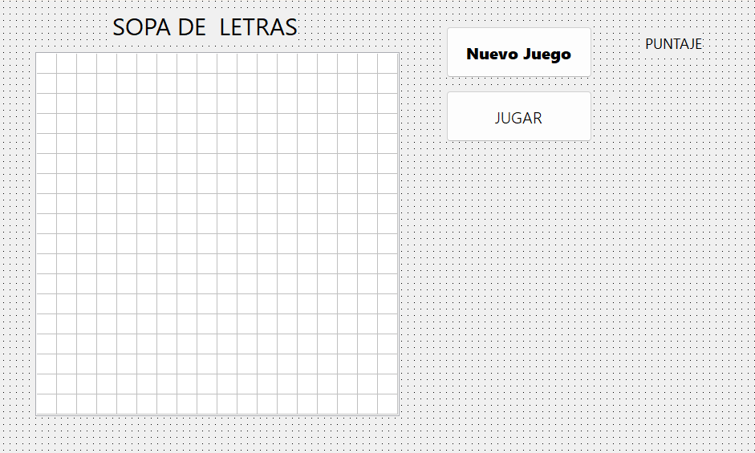

# Pascal: Motor de Videojuego "Sopa de Letras" con Lógica de Matrices e Inserción Aleatoria

Este repositorio contiene un proyecto práctico de ingeniería de software de escritorio desarrollado en **Pascal** utilizando el entorno **Lazarus / Delphi**. La aplicación implementa un motor interactivo para el clásico juego de la Sopa de Letras sobre una matriz bidimensional de caracteres de $18 \times 18$. El núcleo del sistema integra un diccionario de términos indexado, rutinas de filtrado estocástico para la selección de palabras sin colisiones ni repeticiones, y un bucle de juego basado en eventos para evaluar intentos del operador aplicando penalizaciones y recompensas dinámicas de puntuación.

---

## 📊 Interfaz Gráfica del Videojuego

Para que el diseño de tu tablero visual de $18 \times 18$ casilleros se previsualice directamente en la portada de tu repositorio, guarda tu captura de pantalla en la raíz con el nombre exacto de `interfaz_sopa.png`:



---

## ⚙️ Bloques Algorítmicos y Reglas de Negocio

El archivo fuente `src/Unit1.pas` modela la persistencia en memoria y las reglas del juego a través de procedimientos dedicados:

### 1. Sorteo Aleatorio de Fichas sin Repetición (`btn_nuevoClick`)
El sistema utiliza una matriz bidimensional de tipo string (`base_palabras`) que actúa como base de datos. La columna 0 almacena el token léxico y la columna 1 actúa como bandera de estado. Mediante un bucle condicional pos-indicado `repeat..until`, se garantiza la extracción de 4 palabras únicas en cada partida:
```pascal
for p := 0 to 3 do
begin
  repeat
    elegida := random(CantBase); // Sorteo indexado del diccionario
  until base_palabras[elegida, 1] = '0'; // Validación de unicidad

  base_palabras[elegida, 1] := '1'; // Flag de bloqueo
  palabras_escondidas[p] := base_palabras[elegida, 0];
end;

```

### 2. Algoritmo de Incrustación y Relleno de Fondo

Una vez aisladas las cadenas, el motor llena la matriz `sopa` con caracteres aleatorios en mayúsculas (mapeo ASCII del 65 al 90). Posteriormente, ejecuta un bucle de inserción lineal que inyecta las letras de las palabras seleccionadas al inicio de filas estratégicas aplicando saltos coordenados (`fila_actual := 1 + (p * 2)`):

```pascal
for c := 0 to largo_palabra - 1 do
begin
  sopa[fila_actual, c] := palabra[c + 1]; // Inserción en base 1 sobre matriz de memoria
end;

```

### 3. Máquina de Estados y Evaluación de Puntaje (`btn_jugarClick`)

El bucle de juego permite un límite estricto de 4 intentos por partida mediante `inputbox`. Las entradas se normalizan con las funciones `uppercase()` y `trim()` para neutralizar discrepancias de formato, aplicando las siguientes directivas matemáticas de calificación:

* **Entrada vacía:** Penaliza restando $50$ puntos.
* **Acierto confirmado:** Premia sumando $100$ puntos.
* **Fallo por discrepancia:** Penaliza restando $100$ puntos.

---

## 🛠️ Conceptos Técnicos Aplicados

* **Estructuras de Flagging Matricial**: Uso de dimensiones secundarias paralelas para el control de estados atómicos en variables de datos, simulando el comportamiento de bases de datos relacionales sin salir de estructuras nativas en memoria RAM.
* **Normalización Lógica de Hilos (`String Cleaning`)**: Aplicación concurrente de limpieza de espacios laterales (`trim`) y mutación de caja tipográfica (`uppercase`) sobre variables de caracteres para asegurar la equidad en las pruebas de comparación lógica.
* **Mapeo Avanzado ASCII**: Manipulación de offsets enteros combinados con la función `chr()` para restringir la aleatoriedad matemática a conjuntos cerrados de caracteres imprimibles del abecedario.

¡Excelente, Cielo! Subí este último juego organizado en su carpeta, actualizá tu portada y ya tenés indexados tus 4 proyectos de Python, tus 4 tableros de Tableau y tus 4 desarrollos de Pascal. ¡Un portafolio hiper equilibrado y súper profesional! 🚀💥🎮
